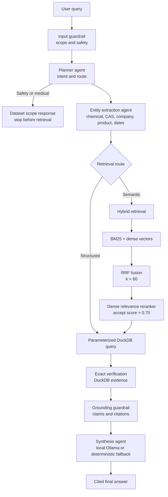

# Cosmetic Chemical Disclosure RAG POC

A local-first Streamlit assistant for California Safe Cosmetics Program disclosures. DuckDB is the factual source of truth, embedded Qdrant discovers semantic chemical candidates, and Ollama runs embeddings and answer synthesis. No hosted LLM API or paid service is used.

## Architecture



Exact CAS, chemical, company, brand, product, category, and date filters use parameterized DuckDB queries. Fuzzy chemical questions retrieve vector K=10 and BM25 K=10, fuse ranks with RRF, cap at 10 candidates, rerank by dense relevance, then accept only scores strictly above 0.70. Accepted names are verified with exact DuckDB queries. MMR is implemented and benchmarked but is not the production default because it did not improve the measured ranking metrics. Answer synthesis uses the local Ollama model when enabled and deterministic text otherwise. Record answers preserve CDPHId and ChemicalId citations.

## Specialized-agent workflow

This is a multi-agent orchestration workflow: specialized agents share typed LangGraph state and each owns one stage of the answer path. They are not presented as independent autonomous systems.

| Agent or stage | Responsibility |
|---|---|
| Input guardrail | Rejects questions outside disclosure-record scope. |
| Planner | Detects intent, date semantics, and the required retrieval route. |
| Entity extraction | Extracts chemical, CAS, company, brand, product, category, and date entities. |
| Retrieval | Executes structured SQL or hybrid semantic retrieval. |
| Evidence builder | Verifies accepted chemical names and builds row-level evidence. |
| Synthesis | Produces a cited answer with local Ollama or deterministic fallback text. |
| Output guardrail | Checks evidence identifiers and unsupported claims before returning the answer. |

The operational path is:

```text
Planner -> Entity extraction -> Retrieval -> Exact verification -> Synthesis
```

## Why LangGraph?

LangGraph fits this workflow because it is stateful and contains conditional routing, validation, and fallback paths. The shared state carries the user question, conversation context, query plan, extracted entities, retrieval candidates, verified evidence, guardrail warnings, final answer, and per-step execution metadata.

The planner routes exact filters to DuckDB and uncertain chemical names to hybrid retrieval. Safety and medical questions stop at a dataset-scope response before entity extraction or retrieval. Semantic retrieval can request clarification when the top candidates are too close; unavailable local vector services fall back to fuzzy candidates without bypassing the relevance cutoff. Data-query routes converge on exact database verification and the output guardrail.

## Retrieval pipeline

```text
Dense search (K=10) + BM25 search (K=10)
                    |
                    v
         RRF fusion: score(d) = sum 1 / (60 + rank(d))
                    |
                    v
            Top 10 candidates by fused rank
                    |
                    v
       Dense relevance reranker, threshold > 0.70
                    |
                    v
          Exact DuckDB verification and citations
```

The reranker score is a query/document relevance score. The `0.70` threshold is an empirical precision-versus-recall choice: it rejects weaker typo and synonym matches, so the benchmark reports both unthresholded RRF and thresholded results.

## Demo

The Streamlit interface exposes the query plan, evidence rows, execution trace, per-step latency, local token usage, and model status. Run it locally with the setup below; screenshots are intentionally omitted until they can be captured from a reproducible runtime.

## Sample queries

The application includes these runnable examples:

| Query | What it demonstrates |
|---|---|
| `Which products contain CAS 75-07-0?` | Exact CAS lookup and cited records. |
| `Which products contain titanium oxide?` | Semantic chemical retrieval and verification. |
| `Show products discontinued in 2020` | Date filtering in DuckDB. |
| `Compare brands AVON and MARK for CAS 13463-67-7 in SubCategory "Lip Color - Lipsticks, Liners, and Pencils", discontinued in 2010.` | Structured comparison with multiple filters. |
| `Summarize reporting trends for New Avon LLC` | Company aggregation and trend output. |
| `Is this chemical safe for pregnancy?` | Scope guardrail: disclosure records do not establish safety or individual health risk. |

## Design decisions

| Choice | Reason |
|---|---|
| DuckDB | Relational disclosure data and exact CAS, company, product, and date filters are more reliable in SQL than semantic search. |
| Qdrant | Persistent local vector similarity search without requiring a hosted vector service. |
| BM25 + dense retrieval | BM25 preserves exact domain terms such as CAS numbers and names; dense search handles semantic similarity and variants. |
| RRF | Combines rankings without requiring lexical and vector scores to share a calibrated scale. |
| Ollama | Supports local embeddings and synthesis without hosted API keys or inference cost. |

## Retrieval evaluation

The checked-in benchmark uses nine curated exact, partial, typo, and synonym-like chemical queries. Curated labels are the primary truth; the local LLM judge is diagnostic only.

| Strategy (K=10) | Precision@10 | Recall@10 | MRR | NDCG |
|---|---:|---:|---:|---:|
| Dense | 0.100 | 1.000 | 0.754 | 0.813 |
| BM25 | 0.056 | 0.556 | 0.481 | 0.500 |
| RRF | 0.100 | 1.000 | 0.750 | 0.810 |
| RRF + reranker (`>0.70`) | 0.056 | 0.556 | 0.556 | 0.556 |

The full K=5/10/20 benchmark, latency measurements, MMR comparison, and judge diagnostics are in [reports/retrieval_benchmark.md](reports/retrieval_benchmark.md).

## Repository structure

```text
app/streamlit_app.py
src/config/                 local paths and Ollama model settings
src/schemas/                Pydantic query/evidence contracts and graph state
src/tools/                  DuckDB, semantic-search, and aggregate tools
src/agents/                 planner, extraction, retrieval, synthesis
src/retrieval/              Ollama embeddings and persistent local Qdrant
src/graph/                  LangGraph workflow and router
src/guardrails/             scope, grounding, and output validation
scripts/                    data utilities and vector-index builder
tests/                      query, agent, vector, graph, model, and UI tests
data/raw/                   supplied CSV
data/processed/             DuckDB database
vectorstore/qdrant/          generated index; ignored by Git
```

The root `structured_query.py` remains a compatibility shim; new imports should use `src.tools.structured_query`.

## Local models and setup

The default models are `qwen2.5:1.5b` for synthesis and `nomic-embed-text` for embeddings. Both run locally through Ollama. They are installed on the development machine but are not bundled in this repository.

Install project packages in Python 3.11+:

```powershell
py -3.11 -m venv .venv
.\.venv\Scripts\python.exe -m pip install -r requirements.txt
```

Install Ollama for Windows, then fetch models if they are not already present:

```powershell
ollama pull qwen2.5:1.5b
ollama pull nomic-embed-text
```

If `ollama` is not on the current PowerShell PATH after installation, restart the shell or invoke `%LOCALAPPDATA%\Programs\Ollama\ollama.exe` directly. Copy `.env.example` to `.env` to override local settings. The UI uses no remote fonts or API calls.

Build or rebuild the vector index:

```powershell
.\.venv\Scripts\python.exe scripts\build_vector_index.py
.\.venv\Scripts\python.exe scripts\build_vector_index.py --force
```

Start the demo:

```powershell
.\.venv\Scripts\python.exe -m streamlit run app\streamlit_app.py
```

The sidebar reports local model status and can disable LLM synthesis. Results include intent, entities, query trace, per-step latency/work details, local prompt/completion token counts, and $0 hosted API cost. Structured search and deterministic answers do not require the answer model; when vector search is unavailable, BM25/fuzzy candidates are shown but do not bypass the strict relevance cutoff.

## Tests and data tools

```powershell
.\.venv\Scripts\python.exe -m unittest discover -s tests -v
.\.venv\Scripts\python.exe scripts\inspect_dataset.py
.\.venv\Scripts\python.exe scripts\test_queries.py
```

Vector and local-model tests skip when Ollama or the configured models are unavailable. Rebuilding the database with `scripts\create_database.py` replaces the existing `cosmetics` table.

Run the labeled K=5/10/20 retrieval benchmark and write the report to `reports/retrieval_benchmark.md`:

```powershell
.\.venv\Scripts\python.exe -m scripts.benchmark_retrieval --llm-judge
```

The benchmark reports Precision@K, Recall@K, HitRate@K, Accuracy@1, MRR, MAP, NDCG, retrieval latency, MMR results, and independent local LLM-judge agreement. Curated labels are the primary metric truth; the local judge is diagnostic only. The current nine-query sample favors K=10 over K=20 on efficiency with tied unthresholded RRF NDCG/MRR. The strict 0.70 relevance cutoff reduces recall on typo/synonym queries, so that precision-versus-recall tradeoff is explicit in the report.

## Security and reliability

- No API keys are required by default; local model settings come from environment variables.
- DuckDB filters use parameterized queries.
- Input scope, evidence grounding, and output claims are validated by guardrails.
- Accepted semantic candidates are verified against exact DuckDB records before synthesis.
- No sensitive user data is persisted by the application.

## Limitations

1. The dataset contains disclosure records, not product safety or exposure assessments.
2. `MostRecentDateReported` currently ends in 2020; there are no records discontinued in 2024.
3. Retrieval quality depends on the supplied dataset and its chemical-name coverage.
4. The local 1.5B synthesis model is lower quality than larger hosted models.
5. The current benchmark contains only nine curated queries.
6. The strict `0.70` threshold improves precision at the cost of typo and synonym recall.

The checked-in database has 114,635 ingredient records across 36,972 products. Zero results describe this dataset only and do not prove that no such products exist elsewhere.